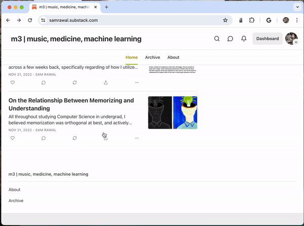

# localsumm 🤖📕
Fast, 100% local web page summarization with the Microsoft Phi-3 LLM!

## demo

## setup
### 1. Install and set up Ollama
1. Install Ollama from https://ollama.com/
2. Make sure the Ollama app is running
3. Install the Phi-3 model: `ollama run phi3`
4. Address CORS Settings - [tutorial](https://medium.com/dcoderai/how-to-handle-cors-settings-in-ollama-a-comprehensive-guide-ee2a5a1beef0)

### 2. Install the localsumm Chrome extension
1. `git clone git@github.com:samrawal/localsumm.git`
2. In Chrome, go to `chrome://extensions` -> Developer Mode (top right) -> Load Unpacked (top left) -> select `localsumm` folder

### You're ready!

## about/contact/issues
This extension has been very quickly put together, so any PRs with bugfixes/features are welcome!

Feel free to reach out to me with any comments, questions, or issues!

- [samrawal.com](http://samrawal.com)
- [@samarthrawal](https://twitter.com/samarthrawal)
